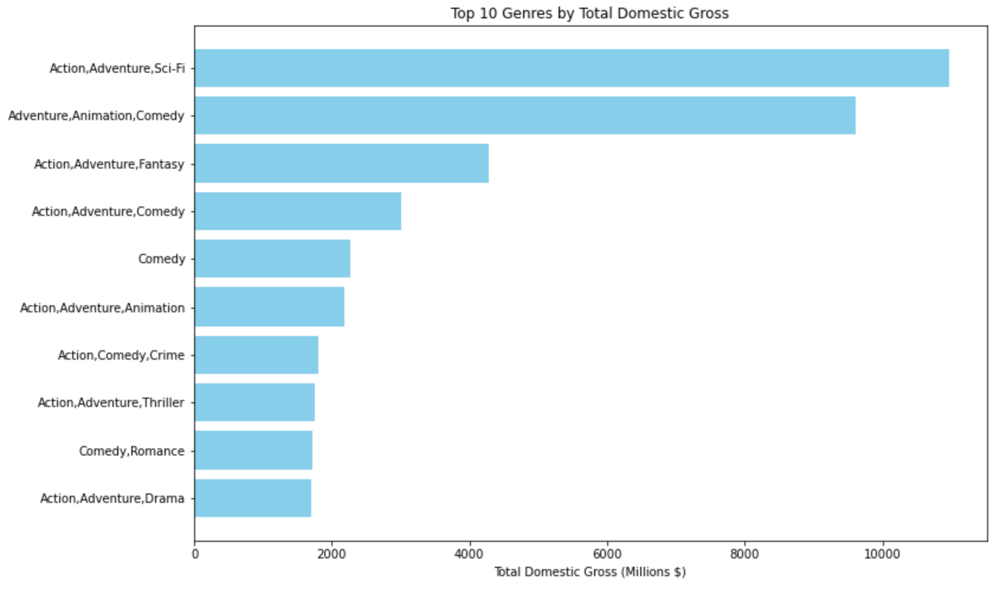
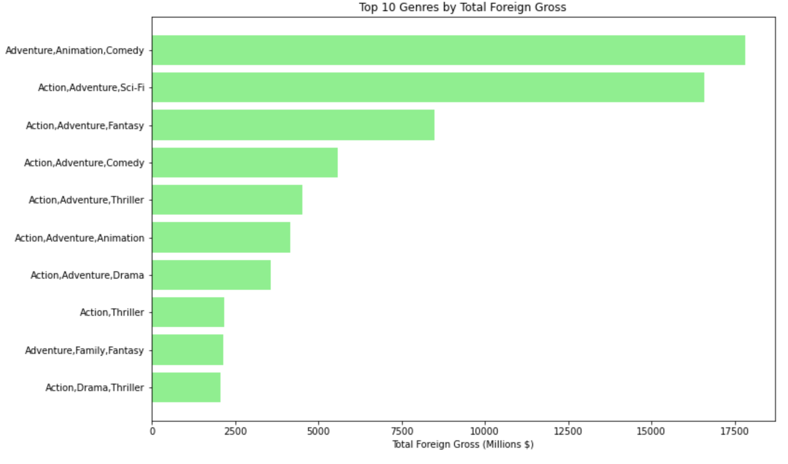
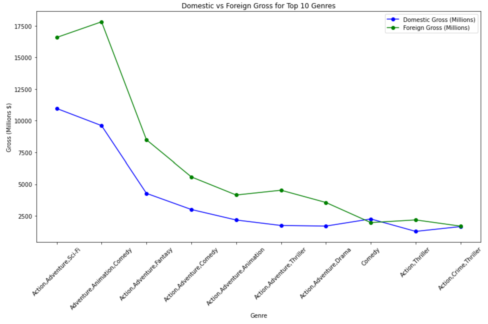
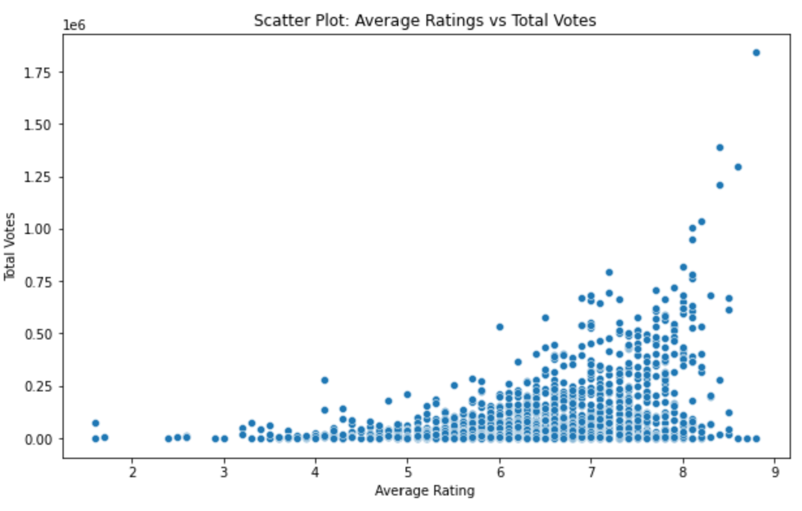

# Microsoft Movie Studio Analysis

**Author**: Joseph Ngige

## Overview

Microsoft's new movie studio aims to identify the most successful movie genres at the box office. By analyzing data from IMDb website and Box Office Mojo websites, I determined that Action, Adventure, and Sci-Fi combinations consistently achieve the highest domestic and foreign gross revenues, as well as the most votes. Adventure, in particular, is a common element in top-performing genres. Therefore, I would recommend focusing on Action, Adventure, and Sci-Fi movies, and also suggest considering Adventure paired with Animation or Fantasy. Additionally, the combination of Adventure, Animation, and Comedy shows strong potential for financial success.

## Business Problem

Microsoft sees all the big companies creating original video content and wants to get in on the fun by creating a new movie studio. However, they lack experience in making movies. They would therefore want to explore which types of movies are currently the most successful at the box office and translating those findings into actionable insights for their new movie studio. To determine the most profitable movie genres, both domestic and foreign sales data for top movie genres was analyzed, as well as the average ratings and number of votes for each genre, to compare their popularity with financial success.

## Data

The data analyzed came from an SQLite database and a CSV file sourced from IMDb and Box Office Mojo websites, respectively. IMDb is a widely-used database for movies, TV shows, video games, and streaming content, while Box Office Mojo tracks global box office revenue, including domestic and international grosses. Using the movie_basics and movie_ratings tables from the IMDb database and the CSV data from Box Office Mojo, I focused on determining the most successful genres by analyzing domestic and foreign gross sales, average ratings, and number of votes.

## Methods

The data was cleaned the data to ensure integrity by addressing missing values. Critical columns like movie_basics and movie_ratings were cleaned by removing rows with missing data, and financial figures were imputed with zeros where appropriate. Data types were standardized for accurate analysis, and financial figures were normalized to millions for readability. I then merged the datasets using common attributes, such as movie titles and IDs, to create a unified dataset containing all essential information. Non-essential columns, such as "studio" and "original_title," were dropped to streamline the dataset.

## Results

Action and adventure genres, especially when combined with elements of sci-fi, comedy, or fantasy, are the most financially successful in the domestic market.



Family-friendly, animated comedies and action-adventure genres are the top performers in foreign markets. The strong presence of mixed genres suggests that combining action with elements of comedy, fantasy, or thriller resonates well with international audiences.



Foreign markets generally contribute more to the total gross of the top 10 genres than domestic markets. This underscores the importance of international appeal for genres, particularly those in the action and adventure categories.



There is a positive correlation between average ratings and total votes, with higher-rated movies generally attracting more votes.




## Conclusions

This analysis leads to the following recommendations for Microsoft's Movie Studio to optimize their strategies and ensure financial success of their movie productions:

1. **Focus on High-Performing Genres**: Prioritize investment in genres that have demonstrated high financial success, particularly Action, Adventure, Sci-Fi, and family-friendly genres.

2. **Leverage International Markets**: Allocate significant marketing and distribution resources to international markets, particularly for family-friendly, animated comedies and action-adventure genres that have shown strong foreign gross performance.

3. **Diverse Genre Combinations**: Develop hybrid genres that combine elements of action, adventure, comedy, and fantasy to maximize audience appeal.

### Next Steps:

Further analyses could yield additional insights to further improve financial success of Microsoft's movie studio:

* **Detailed Sub-Genre Analysis**: Conduct a detailed analysis of sub-genres within the top-performing categories to uncover specific themes or elements that drive success.
* **Predictive Analytics**: Develop predictive models to forecast financial success based on genre, budget, cast, and other factors.
* **Trend Monitoring**: Continuously monitor market trends and analyze the impact of external factors such as technological advancements.
* **Cross-Platform Strategy**: Evaluate the performance of genres across different platforms, including streaming services and digital releases.

## For More Information

See the full analysis in the [Jupyter Notebook](./test-notebook.ipynb) or review this [Presentation](./test_presentation.pdf).

For additional info, contact Joseph Ngige at [elngige@gmail.com](mailto:elngige@gmail.com)

## Repository Structure

Describe the structure of your repository and its contents, for example:

```
├── README.md                                                 <- The top-level README for reviewers of this project
├── movie_studio_analysis.ipynb                               <- Narrative documentation of analysis in Jupyter notebook
├── presentation.pdf                                          <- PDF version of project presentation
├── data                                                      <- Sourced externally
└── images                                                    <- Sourced externally and generated from code
```
